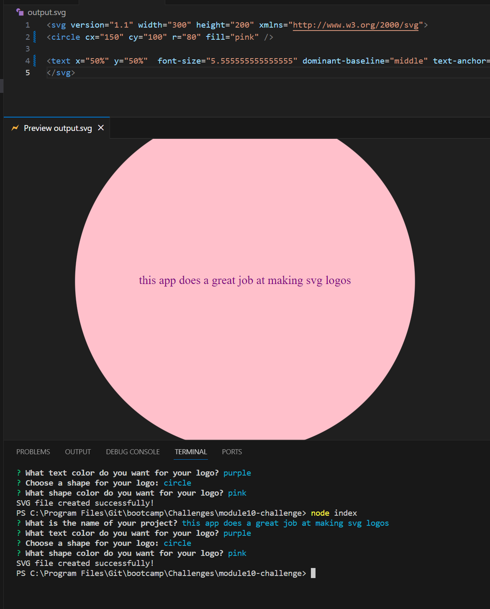

# SVG Generator

## Overview
This application provides users with a straightforward and interactive platform for creating custom logos. Users are prompted to input a logo title and select a shape of their choice. The application facilitates a personalized experience by allowing users to specify text colors using either standard color names or hexadecimal values. An additional standout feature ensures that the text is intelligently fitted into the chosen shape, preventing it from appearing oversized and maintaining a clean and professional aesthetic.

## Table of Contents
- [Overview](#overview)
- [Getting Started](#getting-started)
- [Features](#features)
- [Tests](#tests)
- [Contributing](#contributing)
- [License](#license)
- [Questions](#questions)

## Getting Started
Follow these steps to clone the repository, install necessary packages, and run the serverprogram in the terminal:

Clone the Repository
* Clone the repository to your local machine using the following command: git clone (copied https/ssh)

Install Dependencies
* Navigate to the project directory in your terminal and Install the required Node.js packages using npm: npm install inquirer fs
* This command installs the inquirer and fs packages required for the project.

Run the program
* after packages have been installed run using: node index
* then follow the prompts an your logo will bew generated and added to your outputs folder

Watch a video demonstration of the project [here](https://youtu.be/EfSmncspkCc).

## Features
User-Friendly Interface:
* Intuitive prompts guide users through the process of entering a logo title and selecting a shape, ensuring a seamless experience.

Text Color Customization:
* Users can choose text colors using either common color names or hexadecimal values, providing flexibility and personalization.

Dynamic Text Size Adjustment:
* The application automatically adjusts the text size to fit into the selected shape, preventing oversizing and maintaining a visually appealing logo.

SVG Logo Generation:
* Upon collecting all user input, the application dynamically generates an SVG logo incorporating the specified title, shape, and color preferences.

Efficient and Streamlined Process:
* The application streamlines the logo creation process, offering a clean and efficient user experience from input collection to logo generation.

## Tests
To set up testing for this project, follow these simple steps:

* Ensure you have Node.js installed on your machine.
* Install Jest as a dev dependency by running the following command in your terminal: npm install --save-dev jest

Running Tests
* This project includes four test files named shape.test.js, shapercolor.test.js, text.test.js, and textcolor.test.js. To execute these tests, simply run the following command in your terminal: npx jest

Jest will automatically detect and run all test files in the project, providing you with a summary of the test results.

## Contributing
Thank you for considering contributing to our project! Follow these steps:

* Fork the repository and clone it to your local machine.
* Create a branch, make your changes, and commit them with a clear message.
* Push your changes to your forked repository.
* Open a pull request on the original repository.

Guidelines
* Follow existing code style and conventions.
* Ensure your code is well-documented.

Pull Requests
* Keep them focused and provide a clear description.
* Reference relevant issues if applicable.

## License

This project is not licensed and is provided as-is without any warranty. You are free to use, modify, and distribute the code as you see fit. However, we do not provide any legal protection or support for this project.

## Questions
For questions about this project, contact [prappleman](https://github.com/prappleman) via email at parker.rappleye1@gmail.com.
